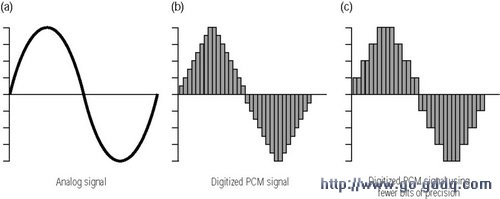
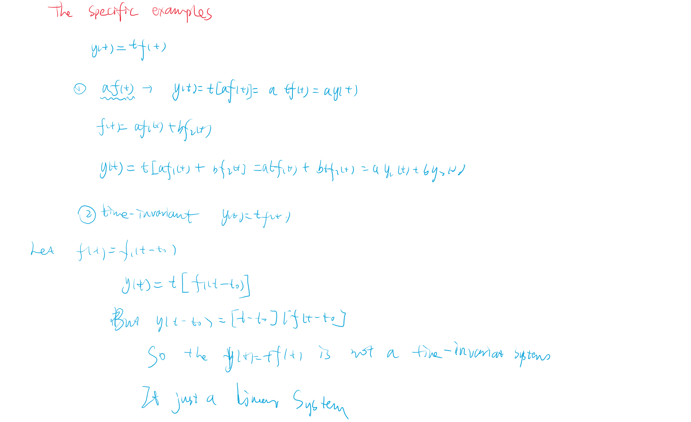
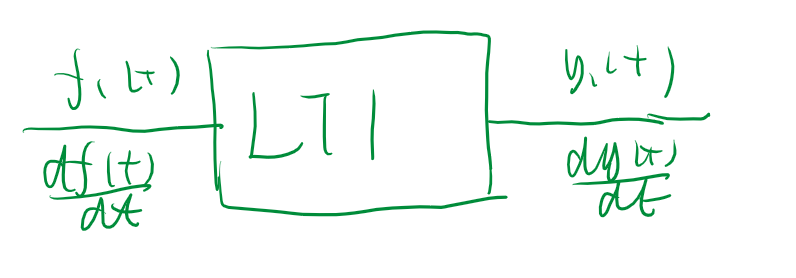

# 导论

## 1.1 信号的描述与分类

- 信号：
  - 侠义：信号是消息的表现形式和传送载体消息是信号的具体内容
  - 广义：信号是随一些参数变化的某种物理量

本课程主要由电信号展开，随着时间t的变化表示成函数。
${连续:}x(t) ,{离散:}x[k] (k \in Z)$

- **信号的分类和特征**
  1. 确定信号和随机信号
     1. 确定信号：由具体的解析式。
     2. 随机信号：不满足信号定义,例如噪声信号
  2. 连续信号和离散信号
     1. 连续信号：定义域为连续区间（$D \in R$）
     2. 离散信号：定义域为离散区间
  3. 连续时间信号与离散时间信号（注意二者的转换关系）
     1. 连续时间信号：信号的定义域为连续时间，通常用解析式表示。
       - 示例：$x(t) = A \cos(2\pi f t + \phi)
     1. 离散时间信号：信号的定义域为离散时间，通常用序列表示。
       - 示例：$x[n] = A \cos(\omega n + \phi)$
  4. 周期信号和非周期信号
     1. 周期信号：在某个时间间隔内具有重复的模式。（最小正数）
     2. 非周期信号：在任何时间间隔内都没有重复的模式。
  5. 功率信号和能量信号
     - 功率信号：信号在无穷时间内的平均功率有限，通常用于描述周期信号。$W \to \infty$(直流信号与周期信号都是功率信号)
     - 能量信号：信号在无穷时间内的总能量有限，通常用于描述非周期信号。$0 < W< \infty$。
  

<!-- 1. 单边频谱信号和双边频谱信号
   - 单边频谱信号：频谱只在正频率范围内有非零值。
   - 双边频谱信号：频谱在正负频率范围内都有非零值。
2. 奇异信号和偶信号
   1. 奇异信号：满足$f(-t) = -f(t)$的信号。
   2. 偶信号：满足$f(-t) = f(t)$的信号。 -->

<!-- 这些分类和特征有助于对不同类型信号的理解和处理。 -->

## 1.2  系统的描述及分类

System：多个部分组成的整体、

- 描述
  - 输入输出描述:（转移，传递，映射，微分/差分方程）
  - 状态变量描述：方程组，中间变量（状态变量）

- **系统的分类**
  - 离散系统和离散系统
  - **_线性系统与非线性系统_**
    - 线性系统：
      - 均匀特性:$x(t) \rightarrow y(t) 则 Kx(t)\rightarrow Ky(t)$
      - 叠加特性：$x_1(t)\rightarrow y_1(t),x_2(t)\rightarrow y_2(t) 则 x_1(t)+ x_2(t) = y_1(t) + y_2(t)$
    - 非线性系统:除线性之外。

>判断系统是否线性系统，我们只需要验证均匀特性和叠加特性