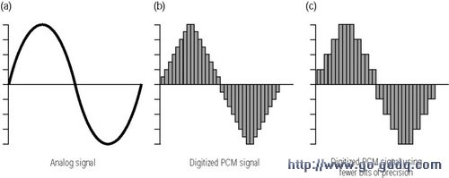
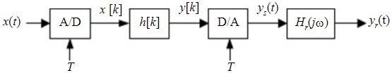
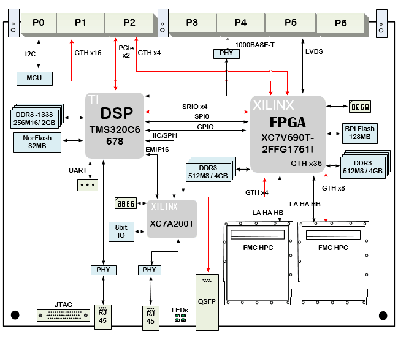
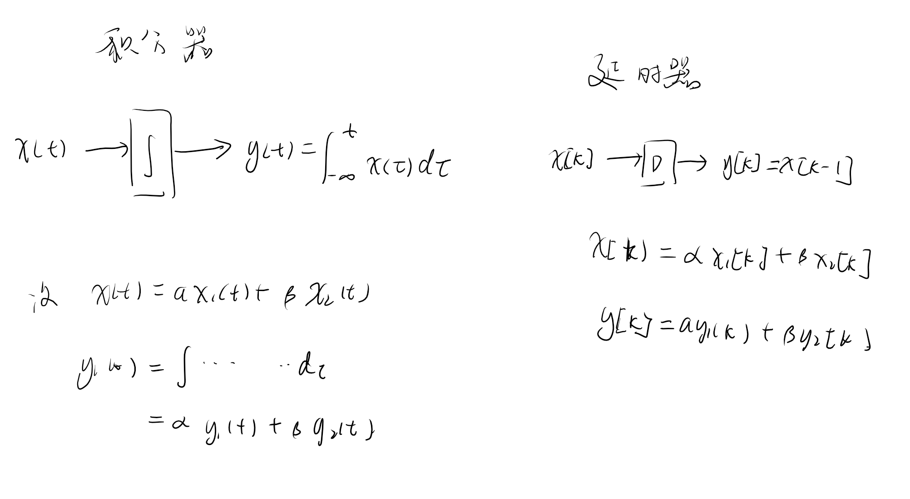
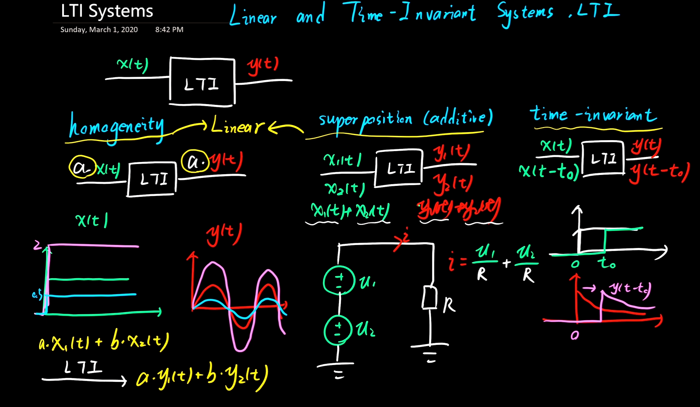
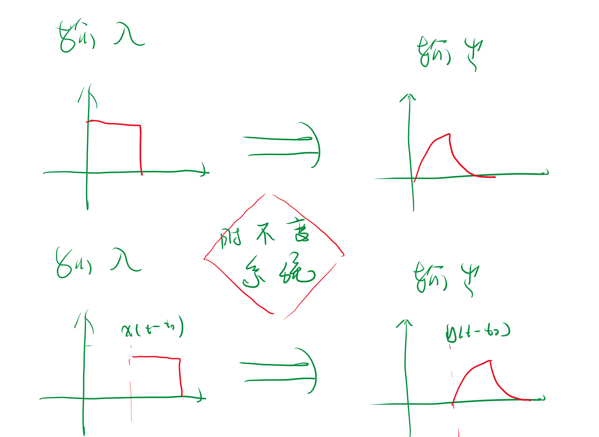
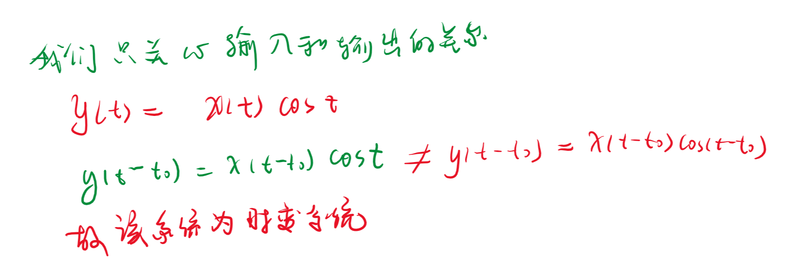
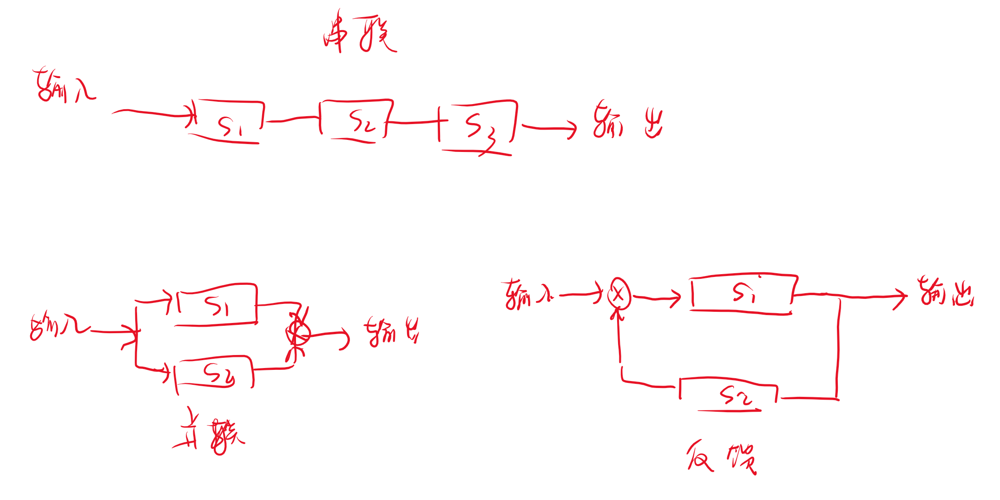

# 导论

<!-- @import "[TOC]" {cmd="toc" depthFrom=1 depthTo=6 orderedList=false} -->

<!-- code_chunk_output -->

- [导论](#导论)
  - [1.1 信号的描述与分类](#11-信号的描述与分类)
  - [1.2  系统的描述及分类](#12--系统的描述及分类)
    - [1.2.1 连续时间系统和离散时间系统](#121-连续时间系统和离散时间系统)
    - [1.2.2 线性系统与非线性系统](#122-线性系统与非线性系统)
      - [1.2.2.1 线性系统的判定](#1221-线性系统的判定)
    - [1.2.3 时变系统有与时不变系统](#123-时变系统有与时不变系统)
    - [1.2.4 因果系统与非因果系统](#124-因果系统与非因果系统)
    - [1.2.5 稳定系统与非稳定系统](#125-稳定系统与非稳定系统)
  - [1.3 系统的连接](#13-系统的连接)

<!-- /code_chunk_output -->

## 1.1 信号的描述与分类

- 信号：
  - 侠义：信号是消息的表现形式和传送载体消息是信号的具体内容
  - 广义：信号是随一些参数变化的某种物理量

本课程主要由电信号展开，随着时间t的变化表示成函数。
${连续:}x(t) ,{离散:}x[k] (k \in Z)$

- **信号的分类和特征**
  1. 确定信号和随机信号
     1. 确定信号：由具体的解析式。
     2. 随机信号：不满足信号定义,例如噪声信号
  2. 连续信号和离散信号
     1. 连续信号：定义域为连续区间（$D \in R$）
     2. 离散信号：定义域为离散区间
  3. 连续时间信号与离散时间信号（注意二者的转换关系）
     1. 连续时间信号：信号的定义域为连续时间，通常用解析式表示。
       - 示例：$x(t) = A \cos(2\pi f t + \phi)
     1. 离散时间信号：信号的定义域为离散时间，通常用序列表示。
       - 示例：$x[n] = A \cos(\omega n + \phi)$
  4. 周期信号和非周期信号
     1. 周期信号：在某个时间间隔内具有重复的模式。（最小正数）
     2. 非周期信号：在任何时间间隔内都没有重复的模式。
  5. 功率信号和能量信号
     - 功率信号：信号在无穷时间内的平均功率有限，通常用于描述周期信号。$W \to \infty$(直流信号与周期信号都是功率信号)
     - 能量信号：信号在无穷时间内的总能量有限，通常用于描述非周期信号。$0 < W< \infty$。
  

<!-- 1. 单边频谱信号和双边频谱信号
   - 单边频谱信号：频谱只在正频率范围内有非零值。
   - 双边频谱信号：频谱在正负频率范围内都有非零值。
2. 奇异信号和偶信号
   1. 奇异信号：满足$f(-t) = -f(t)$的信号。
   2. 偶信号：满足$f(-t) = f(t)$的信号。 -->

<!-- 这些分类和特征有助于对不同类型信号的理解和处理。 -->

## 1.2  系统的描述及分类

System：多个部分组成的整体、

- 描述
  - 输入输出描述:（转移，传递，映射，微分/差分方程）
  - 状态变量描述：方程组，中间变量（状态变量）

- **系统的分类**
  - 离散系统和离散系统
  - **_线性系统与非线性系统_**
    - 线性系统：
      - 均匀特性:$x(t) \rightarrow y(t) 则 Kx(t)\rightarrow Ky(t)$
      - 叠加特性：$x_1(t)\rightarrow y_1(t),x_2(t)\rightarrow y_2(t) 则 x_1(t)+ x_2(t) = y_1(t) + y_2(t)$
    - 非线性系统:除线性之外。

### 1.2.1 连续时间系统和离散时间系统

### 1.2.2 线性系统与非线性系统

线性系统是指遵循线性性质的系统。这里的线性性质指的是系统的叠加性和齐次性。

1. **叠加性（Superposition）：** 如果系统对于两个不同的输入信号的响应，等于分别对这两个输入信号进行处理后的响应之和，那么该系统具有叠加性。这可以用数学表达为：如果对于输入信号 \(x_1(t)\) 和 \(x_2(t)\)，系统的响应分别是 \(y_1(t)\) 和 \(y_2(t)\)，那么对于输入 \(a_1 x_1(t) + a_2 x_2(t)\)，系统的响应将是 \(a_1 y_1(t) + a_2 y_2(t)\)，其中 \(a_1\) 和 \(a_2\) 是常数。

2. **齐次性（Homogeneity）：** 如果系统对于输入信号的缩放，会导致输出信号等比例的缩放，那么该系统具有齐次性。这可以用数学表达为：如果对于输入信号 \(x(t)\)，系统的响应是 \(y(t)\)，那么对于输入 \(a x(t)\)，系统的响应将是 \(a y(t)\)，其中 \(a\) 是常数。

>**判断系统是否线性系统，我们只需要验证均匀特性和叠加特性**，此时我们关系的是输入和输出的关系，也就是验证的均匀特性和叠加特性。

- 特殊的系统
  - 积分器
  - 延时器

积分器和延时器都是线性系统。

==线性系统还可以分解为一个零状态响应和零输入相应：==

线性系统的分解成零状态响应和零输入响应是通过叠加原理来实现的。这一原理基于线性系统的两个基本性质：叠加性和齐次性。

1. **叠加性：** 线性系统对于输入的响应是可叠加的。如果系统对于两个不同输入的响应分别为 \(y_1(t)\) 和 \(y_2(t)\)，那么对于输入 \(x_1(t) + x_2(t)\)，系统的响应将是 \(y_1(t) + y_2(t)\)。即验证$y[x_1(t)+x_2(t)] = y_1(t) + y_2(t)$

2. **齐次性：** 线性系统对于输入的缩放具有齐次性。如果系统对于输入 \(x(t)\) 的响应是 \(y(t)\)，那么对于输入 \(a x(t)\)，系统的响应将是 \(a y(t)\)，其中 \(a\) 是常数。

基于这两个性质，我们可以将系统的总响应 \(y(t)\) 分解为零状态响应 \(y_{zs}(t)\) 和零输入响应 \(y_{zi}(t)\) 的和：

\[y(t) = y_{zs}(t) + y_{zi}(t)\]

其中，\(y_{zs}(t)\) 是系统对于零输入的响应，忽略了初始条件；\(y_{zi}(t)\) 是系统对于零状态的响应，忽略了外部输入。

这种分解的关键在于理解零状态响应和零输入响应的概念。具体来说：

- **零状态响应 \(y_{zs}(t)\)：** 表示在没有外部输入的情况下，系统对于初始条件的响应。这是通过将系统的输入设置为零而产生的响应。

- **零输入响应 \(y_{zi}(t)\)：** 表示在没有初始条件的情况下，系统对于外部输入的响应。这是通过将系统的初始条件设置为零而产生的响应。

通过分别考虑零状态和零输入的情况，我们可以更容易地分析和理解线性系统的行为。这种分解在控制系统、信号处理等领域的系统分析和设计中起着关键作用。

#### 1.2.2.1 线性系统的判定

>https://www.bilibili.com/video/BV1mE411E7CQ?t=152.7

**我们只关心输入和输出的关系**

### 1.2.3 时变系统有与时不变系统

时不变系统：**在零状态条件下**,系统的输出响应与输入激励的关系不随输入激励作用与系统的起点而改变。

整个系统向后平移，与触发点无关。

### 1.2.4 因果系统与非因果系统

### 1.2.5 稳定系统与非稳定系统

## 1.3 系统的连接

1. 级联
2. 并联
3. 反馈

$S_1,S_2,S_3$都是系统。

**信号的表示，系统的描述**

