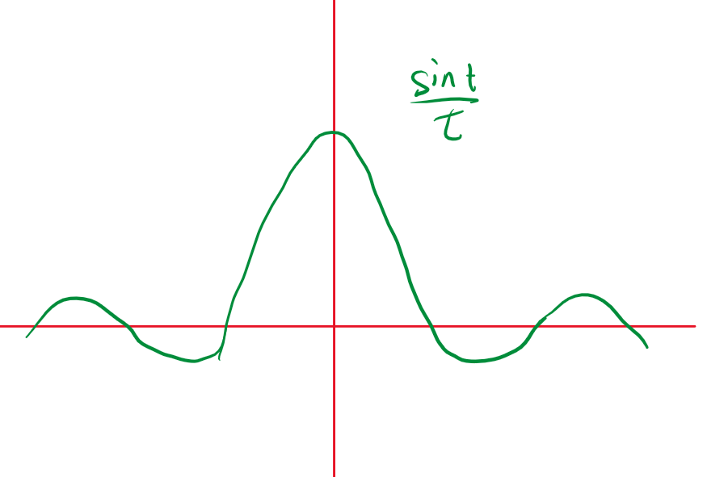

# 连续时间信号

<!-- @import "[TOC]" {cmd="toc" depthFrom=1 depthTo=6 orderedList=false} -->

<!-- code_chunk_output -->

- [连续时间信号](#连续时间信号)
  - [1 普通信号](#1-普通信号)
  - [1 普通信号](#1-普通信号-1)
    - [1.1 直流信号](#11-直流信号)
    - [1.2 正弦信号](#12-正弦信号)
    - [1.3 实指数信号](#13-实指数信号)
    - [1.4 虚指数信号](#14-虚指数信号)
    - [1.5 复指数信号](#15-复指数信号)
    - [1.6 抽样信号](#16-抽样信号)
  - [2 奇异信号](#2-奇异信号)
    - [2.1 单位阶跃信号](#21-单位阶跃信号)
      - [2.1.1  单位阶跃信号的作用](#211--单位阶跃信号的作用)
    - [2.2 单位冲激信号](#22-单位冲激信号)
      - [2.2.1 狄拉克定义](#221-狄拉克定义)
      - [2.2.2 极限角度定义](#222-极限角度定义)
      - [2.2.3 冲激信号的特性](#223-冲激信号的特性)

<!-- /code_chunk_output -->

## 1 普通信号

## 1 普通信号

### 1.1 直流信号

### 1.2 正弦信号

正弦信号是一种周期性信号，通常用以下表达式表示：

\[x(t) = A \sin(\omega t + \phi)\]

其中，

- **振幅 (\(A\)):** 表示正弦波的振幅，即波形的峰值或半峰值。

- **角频率 (\(\omega\)):** 是指正弦波的角频率，表示单位时间内完成的周期数。与频率 (\(f\)) 的关系为 \(\omega = 2\pi f\)。

- **初始相位 (\(\phi\)):** 表示正弦波在 \(t=0\) 时的相位角。

- **周期 (\(T\)):** 表示正弦波完成一个完整周期所需的时间，与角频率关系为 \(T = \frac{1}{f} = \frac{2\pi}{\omega}\)。

- **频率 (\(f\)):** 表示正弦波的频率，即单位时间内完成的周期数，与角频率关系为 \(f = \frac{\omega}{2\pi}\)。

正弦信号在信号处理、通信等领域中广泛应用，因为它具有周期性、稳定性等良好的数学特性。

### 1.3 实指数信号

实指数信号通常用以下形式表示：

\[x(t) = A e^{\sigma t}\]

其中，

- **幅度 (\(A\)):** 表示指数信号的幅度。

- **增长率 (\(\sigma\)):** 是指数信号的增长率，可以为正、负或零。

实指数信号在电路分析、系统稳定性等领域中经常出现，例如在电容的充放电过程中，电压或电流的变化可由实指数信号描述。

### 1.4 虚指数信号

虚指数信号的表达式如下：

\[x(t) = e^{j\omega_0 t} = \cos(\omega_0 t) + j\sin(\omega_0 t)\]

其中，

- **角频率 (\(\omega_0\)):** 表示指数部分的角频率。

虚指数信号是复数域中的信号，通常用于描述振荡现象。它具有周期性，基本周期为 \(\frac{2\pi}{\omega_0}\)。

### 1.5 复指数信号

复指数信号的一般形式如下：

\[x(t) = A e^{st}, \quad s = \sigma + j\omega_0\]

其中，

- **幅度 (\(A\)):** 表示指数信号的幅度。

- **复数 \(s\):** 具有实部 \(\sigma\) 和虚部 \(\omega_0\)，其中 \(\sigma\) 表示增长率，\(\omega_0\) 表示角频率。

复指数信号是一种综合了实指数信号和虚指数信号的信号形式。在控制系统、信号处理等领域中，复指数信号常用于分析系统的动态响应和稳定性。

### 1.6 抽样信号

$$Sa(t) = \frac{\sin t}{t}$$

性质：
$$Sa(0) = 1$$
$$Sa(k\pi) = 0 , k = \pm 1,\pm 2,...$$
$$\int_{-\infty}^{+\infty} Sa(t) dt = \pi$$

## 2 奇异信号

**定义：**函数的本身或其导数或者高阶导数具有不连续点（跳变点，奇异值）。

### 2.1 单位阶跃信号

$$u(t)=\begin{cases}0&t<0\\1&t>0\end{cases}$$

$$\left.u\left(\begin{array}{ll}t-t_0\end{array}\right.\right)=\begin{cases}0&t<t_0\\\\1&t>t_0\end{cases}$$

#### 2.1.1  单位阶跃信号的作用

1. 表示任意矩形脉冲信号
2. 利用节约信号的单边性表示信号的时间范围（选择性）

### 2.2 单位冲激信号

瞬间的超高能量。短时间的作用

#### 2.2.1 狄拉克定义

狄拉克定义：
$$\begin{cases}
    \delta(t) = 0 & \text{当 } t \neq 0 \\
    \int_{-\infty}^{+\infty} \delta(t) \, dt = 1 & 
\end{cases}
$$

#### 2.2.2 极限角度定义

极限角度定义：
一个面积为1的矩形，使他的底部面具无限小，你当然也可以使用三角形来定义。

#### 2.2.3 冲激信号的特性

1. **筛选特性：**
   
   给定冲激函数 \( \delta(t) \)，筛选特性表示：

   \[ x(t) \ast \delta(t) = x(t) \]

   其中 \( \ast \) 表示卷积操作。
    

2. **抽样特性：**

   冲激函数的抽样特性表示：

   \[ \sum_{n=-\infty}^{\infty} x(nT) \delta(t - nT) = \sum_{n=-\infty}^{\infty} x(nT) \]

   其中 \( T \) 是抽样周期。

3. **展缩特性：**

   冲激函数的展缩特性表示：

   \[ \delta(at) = \frac{1}{|a|} \delta(t) \]

   其中 \( a \) 是展缩因子。

1. **筛选特性：**
   
   给定冲激函数 \( \delta(t) \)，筛选特性表示：

   \[ x(t) \ast \delta(t) = x(t) \]

   其中 \( \ast \) 表示卷积操作。
    

2. **抽样特性：**

   冲激函数的抽样特性表示：

   \[ \sum_{n=-\infty}^{\infty} x(nT) \delta(t - nT) = \sum_{n=-\infty}^{\infty} x(nT) \]

   其中 \( T \) 是抽样周期。

3. **展缩特性：**

   冲激函数的展缩特性表示：

   \[ \delta(at) = \frac{1}{|a|} \delta(t) \]

   其中 \( a \) 是展缩因子。

4. **卷积特性**