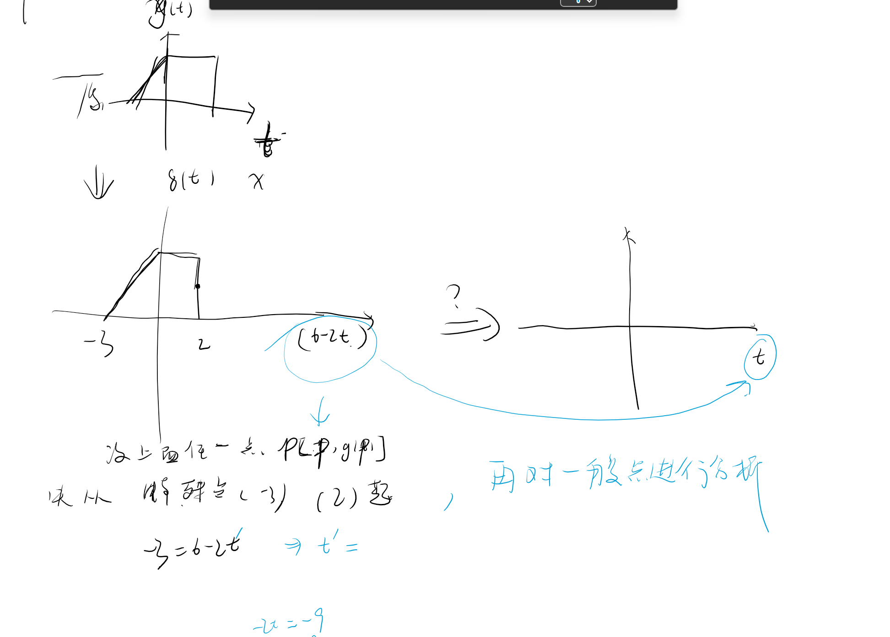

# 连续时间信号的基本运算

## 1 尺度变换（展缩）

$$ x(t) \rightarrow x(at) a>0 $$

a > 0 则是对 x(t) 的压缩

## 2 翻转

$$x(t) = x(-t)$$

## 3 时移(平移)

$$x(t) \rightarrow x(t + t_0)  t_0>0$$

左加右减

[ ] 

### 4 相加

当两个信号分别用$x_1(t)$和$x_2(t)$表示时，它们的相加（叠加）可以表示为：

$$y(t) = x_1(t) + x_2(t)$$

这表示在任意时间$t$，$y(t)$的值等于$x_1(t)$和$x_2(t)$在该时间的值之和。

### 5 相乘

两个信号的相乘可以表示为：

$$y(t) = x_1(t) \cdot x_2(t)$$

这表示在任意时间$t$，$y(t)$的值等于$x_1(t)$和$x_2(t)$在该时间的值相乘。

这两个操作在信号处理中经常用于分析和处理信号。

有点类似于滤波。

## 6 微分

冲激信号可表示信号间断点处信号的导数。其强度值即为信号间断点的跳跃值。

## 7 积分

n阶积分的表示方法

## 8 根据函数图像写表达式

1. 线性组合（需要拆分）
2. 利用阶跃函数的阶段性表示分段函数