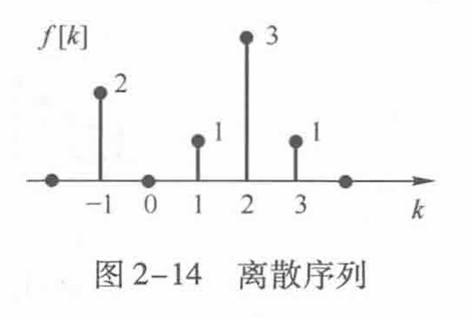
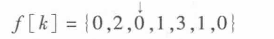
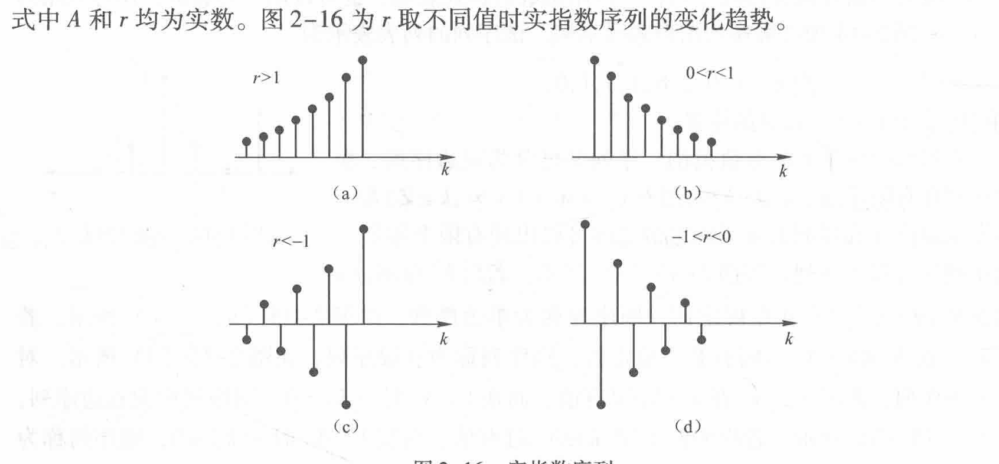
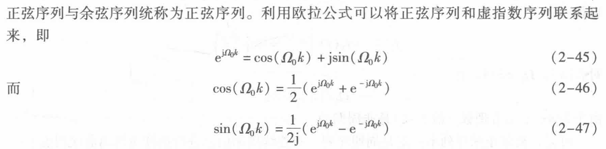
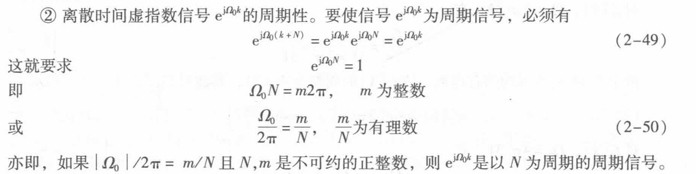
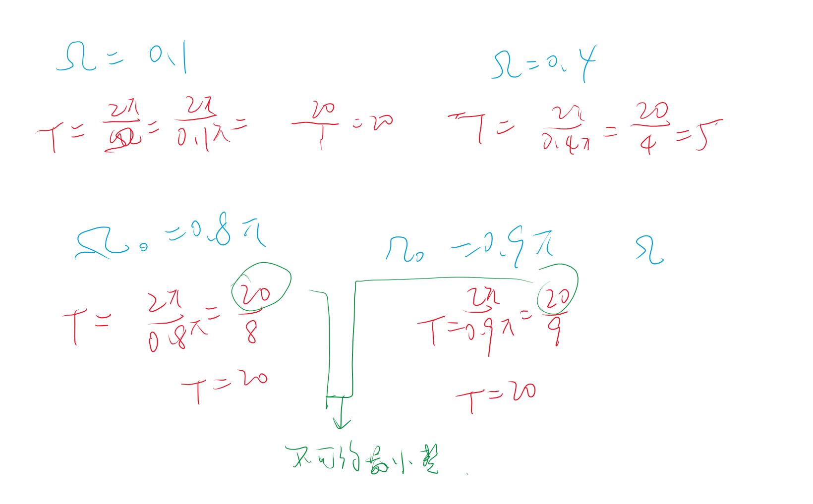

# 离散时间信号

## 1 离散时间信号的表述

- **序列的图形表示**
    

- 序列列表

    

    注意需要给出零起始点，使用箭头标记。

## 2 基本离散序列

离散时间信号有时也成为离散时间序列（定义域不连续）

- 实指数序列
- 虚指数序列

### 2.1 实指数序列

$$f\left[k\right]=Ar^{k},\quad k\in\mathbb{Z}$$

### 2.2 虚指数序列&正弦序列

$$\begin{aligned}f\left[k\right]&=\mathrm{e}^{\mathrm{j}R_{0}k},\quad k\in\mathbf{Z}\\f\left[k\right]&=A\cos\left(\Omega_{0}k+\varphi\right),\quad k\in\mathbf{Z}\end{aligned}$$

**注意离散序列的周期性问题**：周期必为整数

[ ] 抽样周期计算周期问题，上图有问题。