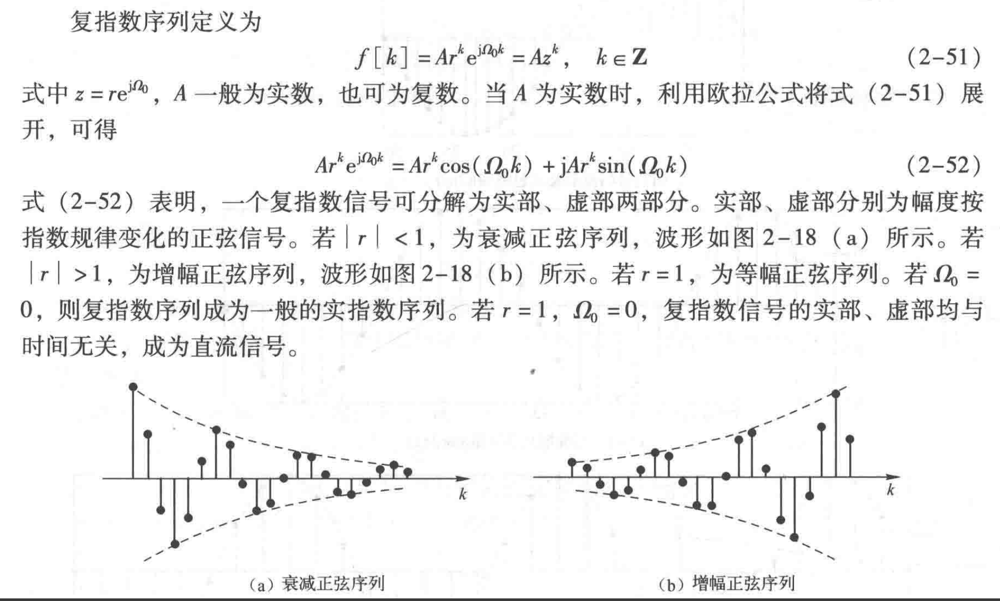

<!--
 * @Author: 小叶同学
 * @Date: 2024-03-07 20:50:47
 * @LastEditors: Please set LastEditors
 * @LastEditTime: 2024-03-19 19:56:21
 * @Description: 请填写简介
-->
# 离散时间信号

<!-- @import "[TOC]" {cmd="toc" depthFrom=1 depthTo=6 orderedList=false} -->

<!-- code_chunk_output -->

- [离散时间信号](#离散时间信号)
  - [1 离散时间信号的表述](#1-离散时间信号的表述)
  - [2 基本离散序列](#2-基本离散序列)
    - [2.1 实指数序列](#21-实指数序列)
    - [2.2 虚指数序列&正弦序列](#22-虚指数序列正弦序列)
    - [2.3 复指数序列](#23-复指数序列)
    - [2.4 单位脉冲序列](#24-单位脉冲序列)
    - [2.5 单位阶跃序列](#25-单位阶跃序列)
    - [2.6 矩形序列](#26-矩形序列)
    - [2.7 斜坡序列](#27-斜坡序列)
  - [3 连续信号和离散信号的区别](#3-连续信号和离散信号的区别)

<!-- /code_chunk_output -->

## 1 离散时间信号的表述

- **序列的图形表示**
    

- 序列列表

    

    注意需要给出零起始点，使用箭头标记。

## 2 基本离散序列

离散时间信号有时也成为离散时间序列（定义域不连续）

- 实指数序列
- 虚指数序列

### 2.1 实指数序列

$$f\left[k\right]=Ar^{k},\quad k\in\mathbb{Z}$$

### 2.2 虚指数序列&正弦序列

$$\begin{aligned}f\left[k\right]&=\mathrm{e}^{\mathrm{j}R_{0}k},\quad k\in\mathbf{Z}\\f\left[k\right]&=A\cos\left(\Omega_{0}k+\varphi\right),\quad k\in\mathbf{Z}\end{aligned}$$

**注意离散序列的周期性问题**：周期必为整数

**离散时间序列的周期和连续时间信号的区别就在于离散时间序列由于抽样问题，并不连续，所以周期必然是正整数，因此N是约到不可约的数。**

抽样就是直接令$t = nT$得到一个离散序列。

- 抽样问题
    

### 2.3 复指数序列

---

$$开始奇异序列$$

### 2.4 单位脉冲序列

对照与冲激信号

- 作用
  - 表示任意离散时间序列（类似基序列，单位化）

### 2.5 单位阶跃序列

脉冲序列和阶跃序列的关系

$$\delta[k] = u[k] -u[k-1]$$
脉冲序列相当于阶跃序列的差分，对应连续信号的微分。

$$u[k] = \sum_{-\infty}^{k}\delta[n]$$

### 2.6 矩形序列

$$R_{N}[k]=\begin{cases}1&0\leq k\leq N-1\\0&\mathrm{otherwise}\end{cases}$$

### 2.7 斜坡序列

$$r[k]=ku[k]$$

## 3 连续信号和离散信号的区别

