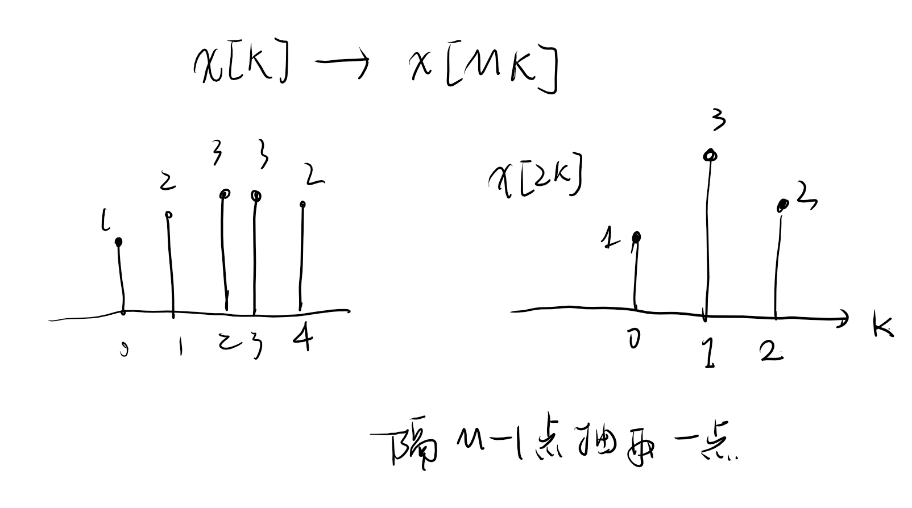
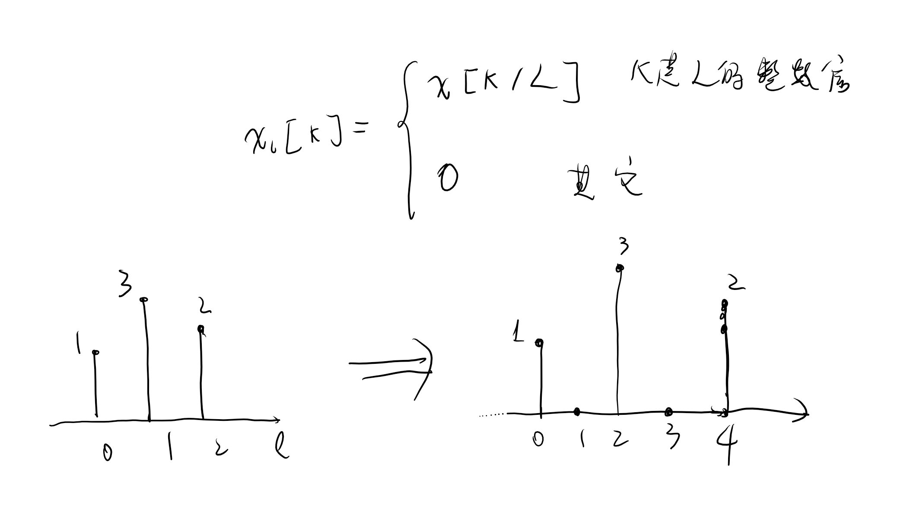
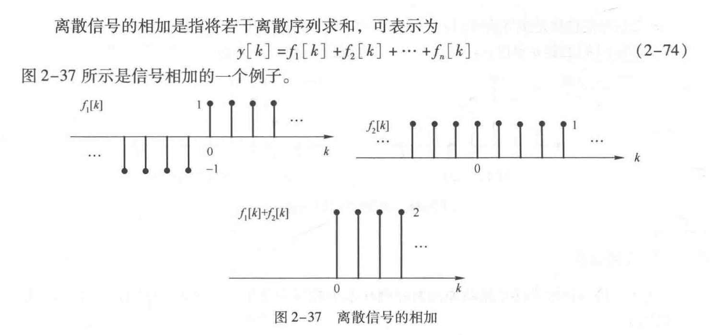
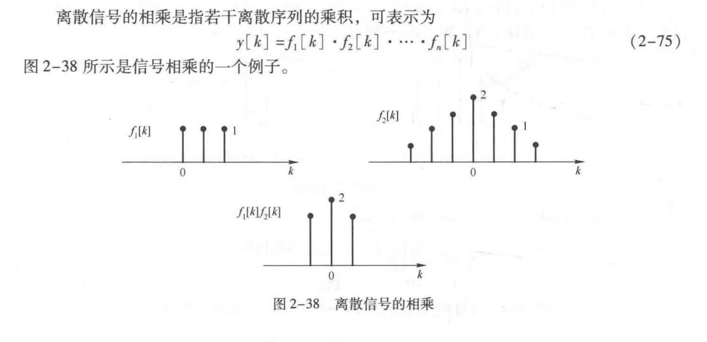
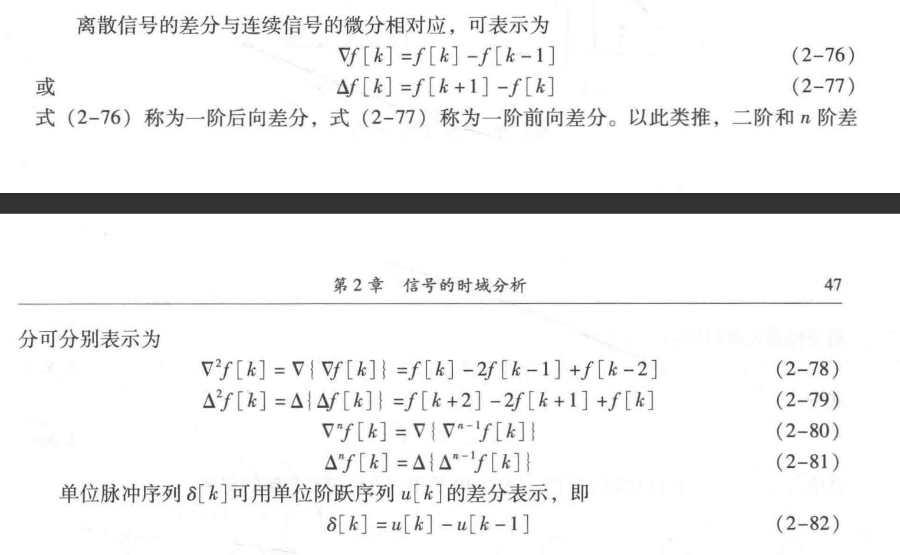
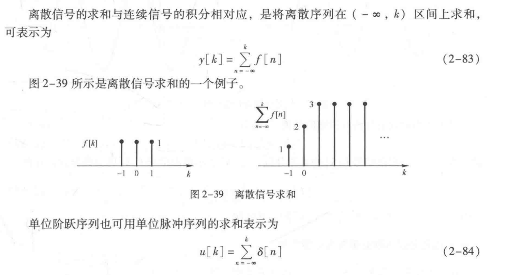

<!--
 * @Author: 小叶同学
 * @Date: 2024-03-19 19:56:41
 * @LastEditors: Please set LastEditors
 * @LastEditTime: 2024-03-19 20:12:01
 * @Description: 请填写简介
-->

# 离散时间信号的基本运算

<!-- @import "[TOC]" {cmd="toc" depthFrom=1 depthTo=6 orderedList=false} -->

<!-- code_chunk_output -->

- [离散时间信号的基本运算](#离散时间信号的基本运算)
  - [1 翻转](#1-翻转)
  - [2 位移](#2-位移)
  - [3 尺度变换（抽取和内插）](#3-尺度变换抽取和内插)
    - [3.1 抽取](#31-抽取)
    - [3.2 内插](#32-内插)
  - [4 相加](#4-相加)
  - [5 相乘](#5-相乘)
  - [6 差分](#6-差分)
  - [7 求和](#7-求和)

<!-- /code_chunk_output -->

## 1 翻转

$$x[k]\rightarrow x[-k]$$

## 2 位移

$$x[k]\rightarrow x[k\pm n] ， n>=0$$

## 3 尺度变换（抽取和内插）

（连续信号称为展缩）

### 3.1 抽取

### 3.2 内插

## 4 相加

## 5 相乘

（相当于滤波）

## 6 差分

## 7 求和

