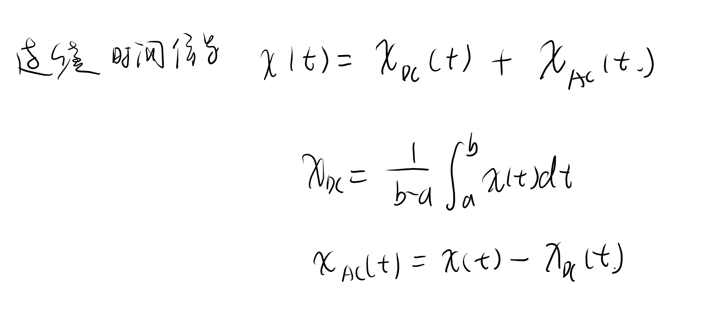
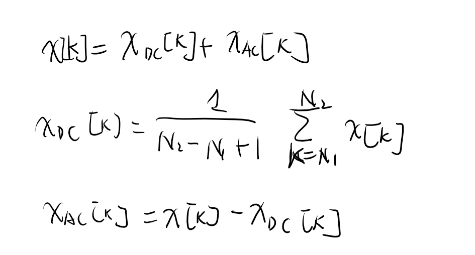
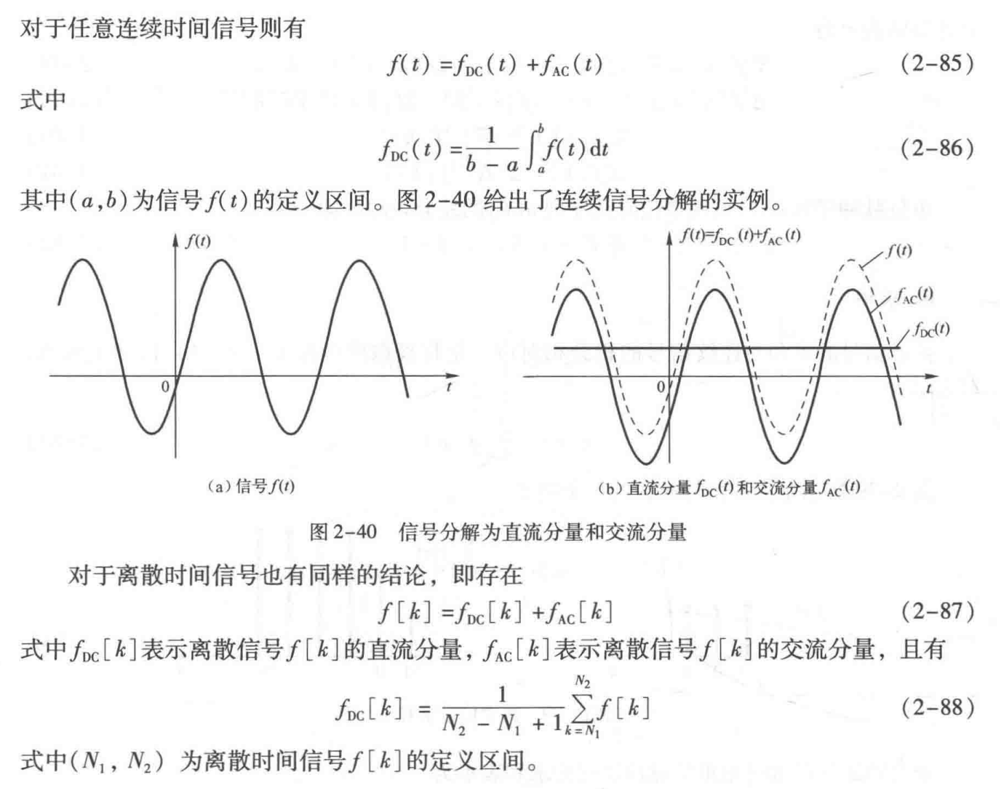
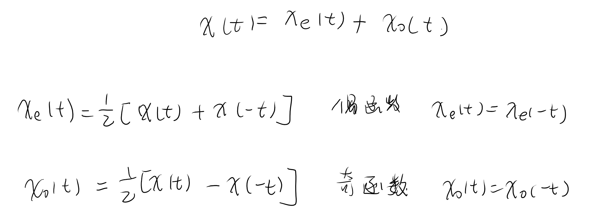

<!--
 * @Author: 小叶同学
 * @Date: 2024-03-19 20:15:38
 * @LastEditors: Please set LastEditors
 * @LastEditTime: 2024-03-19 20:25:15
 * @Description: 请填写简介
-->
# 确定信号的时域分解

<!-- @import "[TOC]" {cmd="toc" depthFrom=1 depthTo=6 orderedList=false} -->

<!-- code_chunk_output -->

- [确定信号的时域分解](#确定信号的时域分解)
  - [1 直流分量与交流分量](#1-直流分量与交流分量)
    - [1.1 连续时间信号](#11-连续时间信号)
    - [1.2 离散时间信号](#12-离散时间信号)
  - [2 奇分量和偶分量](#2-奇分量和偶分量)
    - [2.1 连续时间信号](#21-连续时间信号)
    - [2.2 离散时间信号](#22-离散时间信号)

<!-- /code_chunk_output -->

## 1 直流分量与交流分量

### 1.1 连续时间信号

### 1.2 离散时间信号

**因此重点就是获取直流部分**
也可以认为是获取信号的平均值

## 2 奇分量和偶分量

### 2.1 连续时间信号

### 2.2 离散时间信号

