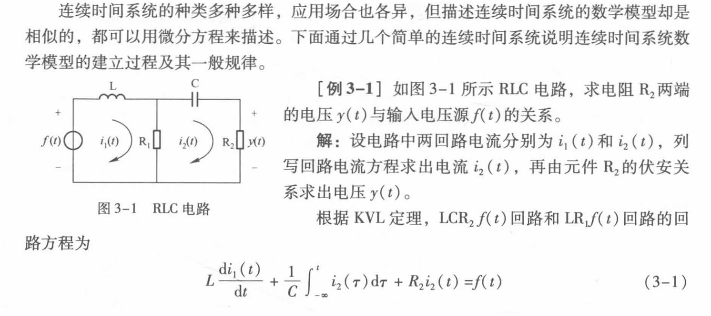
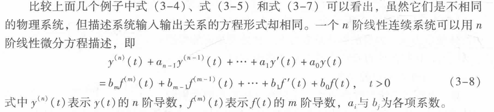
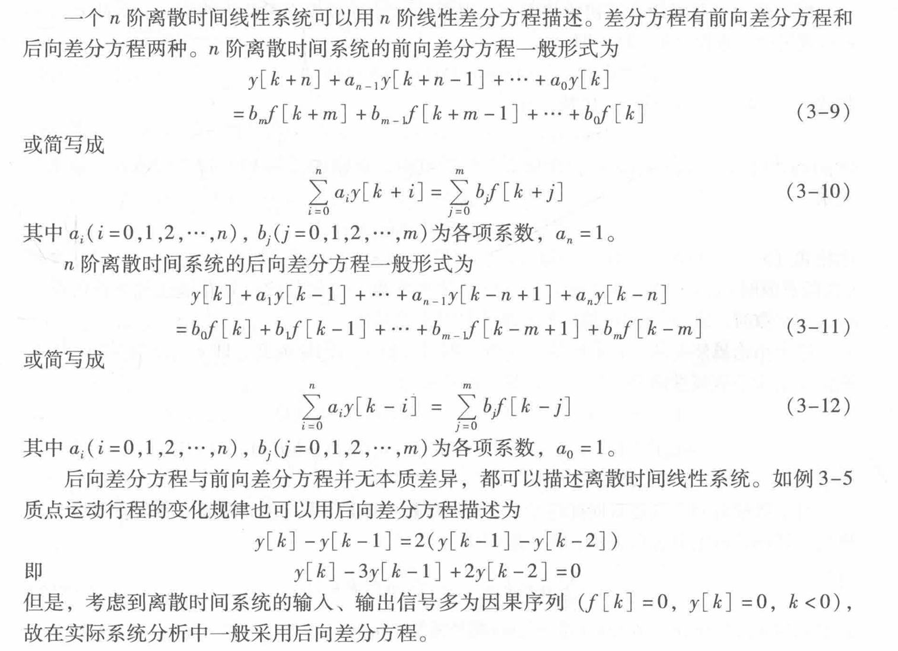

<!--
 * @Author: 小叶同学
 * @Date: 2024-03-21 20:00:43
 * @LastEditors: Please set LastEditors
 * @LastEditTime: 2024-03-21 20:13:33
 * @Description: 请填写简介
-->
# 线性时不变系统的描述及其特性

<!-- @import "[TOC]" {cmd="toc" depthFrom=1 depthTo=6 orderedList=false} -->

<!-- code_chunk_output -->

- [线性时不变系统的描述及其特性](#线性时不变系统的描述及其特性)
  - [1 连续时间系统的数学描述](#1-连续时间系统的数学描述)
  - [2 离散时间系统的数学描述](#2-离散时间系统的数学描述)
  - [3 *线性时不变系统*](#3-线性时不变系统)

<!-- /code_chunk_output -->

## 1 连续时间系统的数学描述

线性微分方程描述

## 2 离散时间系统的数学描述

## 3 *线性时不变系统*

*core

- 微分特性/差分特性
- 积分特性/求和特性
