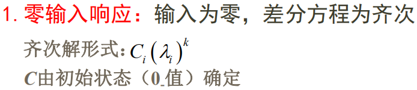

# 离散时间LTI系统的响应

## 1 迭代法

## 2 经典差分方程

## 3 零输入响应

---

## 参考资料
https://blog.csdn.net/qq_44431690/article/details/105237541

## 【离散系统的时域分析】1. 离散系统的响应

最新推荐文章于 2021-11-06 09:50:45 发布

[MR\_Promethus](https://blog.csdn.net/qq_44431690 "MR_Promethus")  最新推荐文章于 2021-11-06 09:50:45 发布

版权声明：本文为博主原创文章，遵循 [CC 4.0 BY-SA](http://creativecommons.org/licenses/by-sa/4.0/) 版权协议，转载请附上原文出处链接和本声明。

## 【 1. 差分与差分方程】

### 1\. 差分

一 阶 向 后 差 分 ： ▽ f ( k ) = f ( k ) − f ( k − 1 ) 一阶向后差分：▽f(k)=f(k)-f(k-1) 一阶向后差分：▽f(k)\=f(k)−f(k−1)  

### 2\. 差分方程

> 例：  
> 

## 【 2. 差分方程的经典解】

### 1\. 求齐次方程的齐次解

### 2\. 求特解

> +   **根据激励形式选特解形式：**  
>     

## 【 3. 零输入响应、零状态响应 】

## 【 4. 总结 】

1.  求零输入响应步骤：  
    ①通过递归求出初始值。  
    ①令输入为0，根据特征方程求出特征根，写出齐次解的形式。  
    ②将初始值待入齐次解，求得系数。
2.  求零状态响应步骤：  
    ①递归求得初始值。  
    ②求出其特征方程对应的特征根，得到齐次解。  
    ③通过激励确定特解的形式，带入零状态方程，得到特解。  
    ④将初始值待入到齐次解+特解=通解的方程中，求得系数。