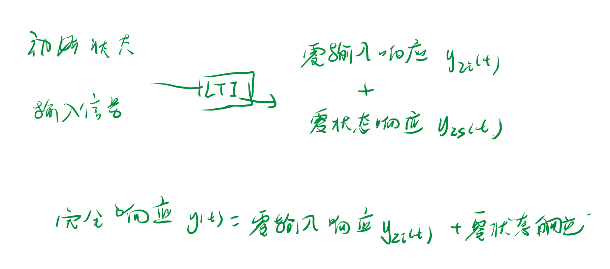
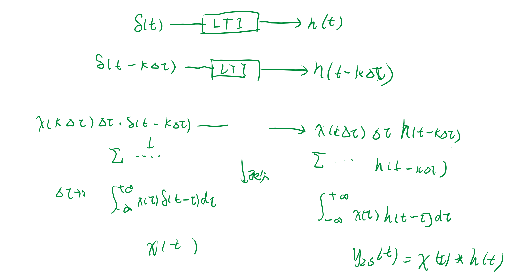

<!--
 * @Author: 小叶同学
 * @Date: 2024-03-21 20:19:37
 * @LastEditors: 
 * @LastEditTime: 2024-03-21 20:19:37
 * @Description: 请填写简介
-->
# 连续时间系统的响应

- **求常系数线性微分方程**
- **基于零输入响应和零状态响应的方法**[课程需求]

## 1 经典时域分析方法（微分方程）

使用传统的特征根法

- 齐次解
- 特解

- 缺点
  - 输入变化时要重新求解

## 2 基于零输出响应和零状态响应的方法

### 2.1 零输入响应

输入信号为零，仅有系统的初始状态单数作用与系统而产生的响应成为零状态响应。

### 2.2 零状态响应

1. 将输入信号表示为单位冲激信号的线性组合
2. 任意的输入信号产生的零状态响应就是输入信号和冲激信号的卷积

---

