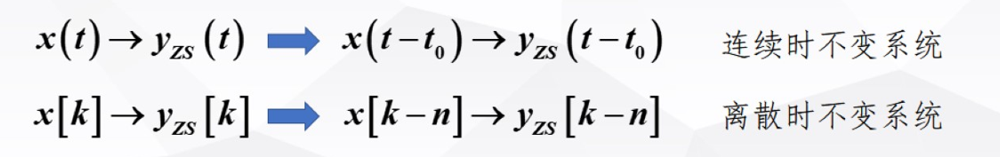

# 导论
- [导论](#导论)
  - [1 信号的描述及其分类](#1-信号的描述及其分类)
    - [1.1 描述](#11-描述)
    - [1.2 分类](#12-分类)
      - [1.2.1 周期信号非周期信号判定](#121-周期信号非周期信号判定)
      - [1.2.2 能量信号与功率信号](#122-能量信号与功率信号)
  - [2 系统的描述及其分类](#2-系统的描述及其分类)
    - [2.1 描述](#21-描述)
    - [2.2 分类](#22-分类)
      - [2.2.1 线性系统与非线性的判定](#221-线性系统与非线性的判定)
      - [2.2.2 时不变系统判定](#222-时不变系统判定)
  - [后面章节的主要结构](#后面章节的主要结构)

## 1 信号的描述及其分类

### 1.1 描述

我们对信号如何去描述？
首先清除信号的定义就是：消息的表现形式或载体，消息是信号的具体内容。因此声光电都是信号，广义上信号就是随着一些参数变化的某种物理量，由此隐身得出信号的描述

**函数描述，图形描述：**

### 1.2 分类

- 确定信号，随机信号
- 连续信号，离散信号
- 周期信号，非周期信号

#### 1.2.1 周期信号非周期信号判定

**判断周期性的方法就是根据定义出发，无论是连续还是离散信号**
$$x(t+T) = x(t)$$
$$x[k+N] = x[k]$$

#### 1.2.2 能量信号与功率信号

需要满足组归一化调暗劲

1. 能量信号：
   1. 能量归一化为有限值
   2. 功率归一化为零
2. 功率信号：
   1. 能量归一化为无限（持续的提供，）
   2. 功率归一化为有限制

**我们可以根据图形的表征来看能量信号与功率信号，并且结合归一化条件去量化分析这种表征**

- 我们先给出功率归一化和能量归一化得含义

  - 功率：表现为一种区间上体能量除以区间长度，区间往往取全域才能整体上衡量信号得功率还是能量特性
  - 能量：表现为在一定得全域上具有有限得积分值，

- 图形上：（根据幅值得分布来衡量，即分布特性）
  - 能量信号：表征为暂时的一种供给，全域积分有限，因此不存在功率，他会体现为在其余得部分值为 0，总之表征为全域积分为有限值
  - 功率信号：表征为一种长期得供给，即在全域上表现长期得能量供给，因此表征为全域积分为无穷

- 公式量化分析
  - 功率归一化
    - $$P=\lim_{T\to\infty}\frac{1}{T}\int_{-T/2}^{T/2}\Bigl|x(t)\Bigr|^2\mathrm{d}t$$
    - $$P=\lim_{N\to\infty}\frac1{2N+1}\sum_{k=-N}^N\left|x[k]\right|^2$$
  - 能量归一化
    - $$W=\lim_{T\to\infty}\int_{-T/2}^{T/2}\left|x(t)\right|^2\mathrm{d}t$$
    - $$W=\lim_{N\to\infty}\sum_{k=-N}^N\left|x[k]\right|^2$$

## 2 系统的描述及其分类

### 2.1 描述

- 描述
  - 外部描述：输入输出描述（ex：N 阶微分方程，差分方程）
  - 内部描述： 状态变量描述（描述系统内部的变量关系，N 个微分方程组合）

当我们关系输入输出并且对系统的整体进行把控的时候往往采用系统的方框图

### 2.2 分类

1. 连续和离散
2. 线性和非线性
3. 时不变和时变
4. 非重点
   1. 因果和非因果
   2. 稳定和非稳定

这些分类内部相互互补，但是外部可以相互组合，例如连续的线性时不变系统等等

清晰了分类之后我们对系统分类的判定给出方法，主要针对重点的分类进行判断

#### 2.2.1 线性系统与非线性的判定

- 判定方法
  1 .当系统描述为至于输入量相关（即显性表达式）可以使用线性性判别法、 2. 当系统为隐性表达式的时候应该采用零状态和零输入来判定，（或者转化为显性）

- 线性性

  - 齐次性：
  - 可加性：
    

- ZS&ZI 判别法
  - 将函数表征为$y(0),x(t)$的各自线性组合的和
  - $$y(t)=T\left\{\begin{bmatrix}x(t)\\y(0^-)\end{bmatrix}\right\}=T\left\{\begin{bmatrix}0\\y(0^-)\end{bmatrix}+\begin{bmatrix}x(t)\\0\end{bmatrix}\right\}=T\left\{\begin{bmatrix}0\\y(0^-)\end{bmatrix}\right\}+T\left\{\begin{bmatrix}x(t)\\0\end{bmatrix}\right\}=y_{ZI}\left(t\right)+y_{ZS}\left(t\right)$$

#### 2.2.2 时不变系统判定

## 后面章节的主要结构

