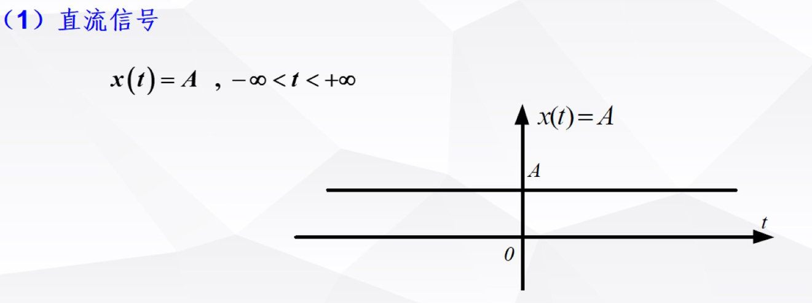
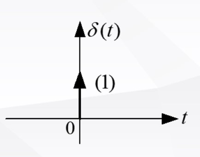
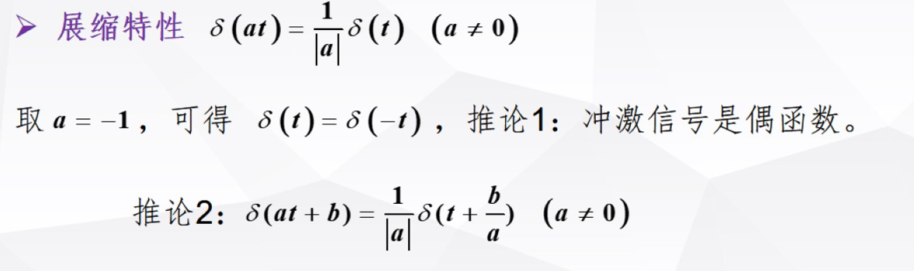
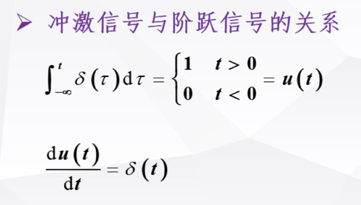
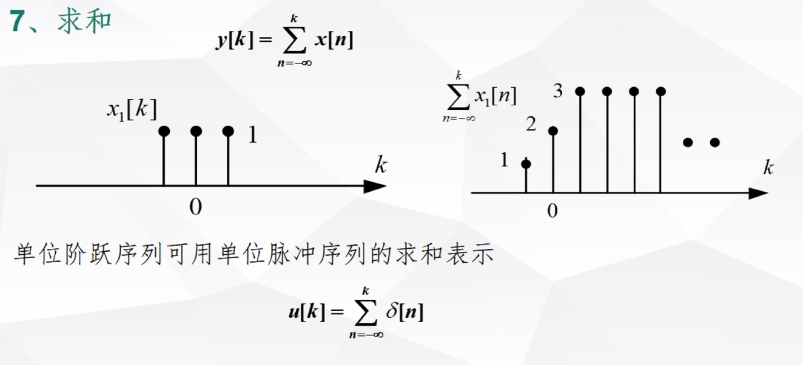

# 信号的分析

- [信号的分析](#信号的分析)
  - [1 常见的信号](#1-常见的信号)
    - [1.1 连续时间信号](#11-连续时间信号)
      - [1.1.1 基本信号](#111-基本信号)
        - [1.1.1.1 连续系统的基本信号](#1111-连续系统的基本信号)
          - [1.1.1.1.1 直流信号](#11111-直流信号)
          - [1.1.1.1.2 正余弦信号](#11112-正余弦信号)
          - [1.1.1.1.3 实指数信号](#11113-实指数信号)
          - [1.1.1.1.4 虚指数信号](#11114-虚指数信号)
          - [1.1.1.1.5 复指数信号](#11115-复指数信号)
          - [1.1.1.1.6 抽样信号](#11116-抽样信号)
      - [1.1.2 奇异信号](#112-奇异信号)
        - [1.1.2.1 单位阶跃信号](#1121-单位阶跃信号)
        - [1.1.2.2 ==单位冲激信号==](#1122-单位冲激信号)
          - [1.1.2.2.1 筛选特性](#11221-筛选特性)
          - [1.1.2.2.2 抽样特性](#11222-抽样特性)
          - [1.1.2.2.3 展缩特性](#11223-展缩特性)
          - [1.1.2.2.4 卷积特性](#11224-卷积特性)
          - [1.1.2.2.5 冲激信号和阶跃信号的关系](#11225-冲激信号和阶跃信号的关系)
        - [1.1.2.3 斜坡信号](#1123-斜坡信号)
        - [1.1.2.4 单位冲激偶信号](#1124-单位冲激偶信号)
      - [1.1.3 信号之间的关系](#113-信号之间的关系)
    - [1.2 离散时间信号](#12-离散时间信号)
      - [1.2.0 //冲激函数](#120-冲激函数)
      - [1.2.1 实指数序列](#121-实指数序列)
      - [1.2.2 虚指数序列\&正弦序列](#122-虚指数序列正弦序列)
      - [1.2.3 复指数序列](#123-复指数序列)
      - [1.2.4 单位脉冲序列](#124-单位脉冲序列)
      - [1.2.5 单位阶跃信号](#125-单位阶跃信号)
      - [1.2.6 矩形序列](#126-矩形序列)
      - [1.2.7 斜坡序列](#127-斜坡序列)
    - [1.3 相互的关系](#13-相互的关系)
  - [2 基本运算](#2-基本运算)
    - [2.1 连续时间信号的运算](#21-连续时间信号的运算)
      - [2.1.1 展缩](#211-展缩)
      - [2.1.2 翻转](#212-翻转)
      - [2.1.3 时移](#213-时移)
      - [2.1.4 相加](#214-相加)
      - [2.1.5 相乘](#215-相乘)
      - [2.1.6 微分](#216-微分)
      - [2.1.7 积分](#217-积分)
    - [2.2 离散时间信号的运算](#22-离散时间信号的运算)
      - [2.2.1 翻转](#221-翻转)
      - [2.2.2 位移](#222-位移)
      - [2.2.3 尺度变换（抽取与内插）](#223-尺度变换抽取与内插)
      - [2.2.4 相加](#224-相加)
      - [2.2.5 相乘](#225-相乘)
      - [2.2.6 差分](#226-差分)
      - [2.2.7 求和](#227-求和)
  - [3 时域分解](#3-时域分解)
    - [3.1 直流，交流分量](#31-直流交流分量)
      - [3.1.1 连续时间信号](#311-连续时间信号)
      - [3.1.2 离散时间信号](#312-离散时间信号)
    - [3.2 奇，偶分量](#32-奇偶分量)
      - [3.2.1 连续时间信号](#321-连续时间信号)
      - [3.2.2 离散时间信号](#322-离散时间信号)
    - [3.3 实部，虚部分量](#33-实部虚部分量)
    - [3.4 冲激信号的线性组合](#34-冲激信号的线性组合)
      - [3.4.1 连续时间信号](#341-连续时间信号)
      - [3.4.2 离散时间信号](#342-离散时间信号)

本书导论介绍了信号与系统的描述以及分类，现在需要开始对信号呵呵系统进行分析

先开始对信号进行分析

信号主要对时域进行分析

- [ ] 目标

  - [ ] 常见的基本信号
  - [ ] 信号的基本运算
  - [ ] 确定信号的时域分解

- 基本信号
- 基本运算
- 基本分解

## 1 常见的信号

**常见的信号可以通过数学表达式的特征分为基本信号和奇异信号**

- 基本信号：表征为一种连续的，不跳变的，倒数微分连续的
- 跳变点，不连续，间断...
  [这只是总体上的表征，具体情况还看细分]

**基本信号往往是用于表述信号本身，而奇异信号往往根据特性产生作用，筛选，抽样，展缩等等**

### 1.1 连续时间信号

#### 1.1.1 基本信号

**基本信号主要分为连续时间信号异界离散时间信号**

##### 1.1.1.1 连续系统的基本信号

###### 1.1.1.1.1 直流信号

###### 1.1.1.1.2 正余弦信号

###### 1.1.1.1.3 实指数信号

$$x\left(t\right)=Ae^{\alpha t}$$

###### 1.1.1.1.4 虚指数信号

**徐知书信号可以和正余弦信号相互转化**

$$x\left(t\right)=e^{j\omega_0t}=\cos\omega_0t+j\sin\omega_0t$$

$$\cos\left(\omega_0t\right)=\frac12\left(e^{j\omega_0t}+e^{-j\omega_0t}\right)\\\sin\left(\omega_0t\right)=\frac1{2j}\left(e^{j\omega_0t}-e^{-j\omega_0t}\right)$$

因此复指数信号可以表现为指数信号，正弦信号的结合，有了三角函数和指数的相互结合，表征为了一种振荡

###### 1.1.1.1.5 复指数信号

这种震荡可以描述阻尼的弹簧系统

###### 1.1.1.1.6 抽样信号

#### 1.1.2 奇异信号

##### 1.1.2.1 单位阶跃信号

**注意 0 点是，函数是跳变不连续的，该点间断未定义**

- 作用
  - 表示矩形脉冲信号
  - 选取信号区间（时间范围）

单位阶跃往往可以用来形成矩形脉冲信号

##### 1.1.2.2 ==单位冲激信号==

$$\begin{cases}\int_{-\infty}^\infty\delta\left(t\right)dt=1\\\delta\left(t\right)=0,t\neq0\end{cases}$$

在信号系统中我们用括号著名冲激信号的强度，单位冲激信号的强度为（1）,强度用全域积分数值量化

- ==性质==
  - 筛选特性
  - 抽样特性
  - 展缩特性
  - 卷积特性
  - 与阶跃信号的关系

###### 1.1.2.2.1 筛选特性

###### 1.1.2.2.2 抽样特性

在筛选特性的基础上保留了原信号的数值，因此利用对筛选特性积分即可

###### 1.1.2.2.3 展缩特性

**体现出了将冲击的时间拉长 a 倍，则能量也衰减 a 倍**

###### 1.1.2.2.4 卷积特性

###### 1.1.2.2.5 冲激信号和阶跃信号的关系

##### 1.1.2.3 斜坡信号

##### 1.1.2.4 单位冲激偶信号

特性：

#### 1.1.3 信号之间的关系

### 1.2 离散时间信号

离散时间用序列的列表表示，即数组

#### 1.2.0 //冲激函数

这里其实可以补充冲击序列，因为连续时间信号的冲激信号本身就是离散的，所以可以在离散时间序列内直接沿用

#### 1.2.1 实指数序列

#### 1.2.2 虚指数序列&正弦序列

#### 1.2.3 复指数序列

#### 1.2.4 单位脉冲序列

- 作用
  - 表示任意离散时间序列

#### 1.2.5 单位阶跃信号

注意与连续时间信号做区分，在连续信号内，跳跃点是间断的，无定义，但是由于离散序列内本来就是离散的，因此原本连续时间离散的反而在离散序列中体现出了连续

#### 1.2.6 矩形序列

#### 1.2.7 斜坡序列

### 1.3 相互的关系

## 2 基本运算

### 2.1 连续时间信号的运算

#### 2.1.1 展缩

#### 2.1.2 翻转

#### 2.1.3 时移

#### 2.1.4 相加

#### 2.1.5 相乘

**调制**

#### 2.1.6 微分

**此处中通过点注意间断点的微分，使用冲激信号表示间断点的微分，这里也是体现该点跳变的原因是因为受到了一个冲激信号，冲击信号用来反映该点突然激变的幅值。**

#### 2.1.7 积分

### 2.2 离散时间信号的运算

#### 2.2.1 翻转

#### 2.2.2 位移

#### 2.2.3 尺度变换（抽取与内插）

#### 2.2.4 相加

#### 2.2.5 相乘

#### 2.2.6 差分

#### 2.2.7 求和

## 3 时域分解

- 分解方式
  - 直流分量，交流分量
  - 偶分量，奇分量
  - 实部，虚部
  - 冲激信号的线性组合

**该章节分解方便起见对会把连续和离散一起分析**

### 3.1 直流，交流分量

#### 3.1.1 连续时间信号

$$x(t)=x_{\mathrm{DC}}(t)+x_{\mathrm{AC}}(t)$$

$$x_{\mathrm{DC}}(t)=\frac{1}{b-a}\int_{a}^{b}x(t)\mathrm{d}t\\x_{\mathrm{AC}}(t)=x(t)-x_{\mathrm{DC}}(t)$$

直流分量特性表现出该信号在全域积分的平均值，交流分量体现出基于改平均值的波动

- 直流分量： 均值
- 交流分量：波动（整体信号减去均值）

#### 3.1.2 离散时间信号

从上获得灵感，离散域的均值用求和，即代数平均值来表示

$$x[k]=x_{\mathrm{DC}}[k]+x_{\mathrm{AC}}[k]$$

$$x_{\mathrm{DC}}[k]=\frac{1}{N_2-N_1+1}\sum_{k=N_1}^{N_2}x[k]$$

$$x_{\mathrm{AC}}[k]=x[k]-x_{\mathrm{DC}}[k]$$

### 3.2 奇，偶分量

#### 3.2.1 连续时间信号

**这里直接利用函数本身的特性，即任意函数都可以分解为奇函数和偶函数的和，并且具有唯一性**

$$x(t)=x_{\mathrm{e}}(t)+x_{\mathrm{o}}(t)$$
$$x_\text{e}(t)=\frac{1}{2}[x(t)+x(-t)]\quad x_\text{o}(t)=\frac{1}{2}[x(t)-x(-t)]$$

#### 3.2.2 离散时间信号

**延续了连续时间信号的方法**

这种方法在堆成型分析中非常具有作用
**分析较较强对称性，但是又不完全对称，将其机型奇偶分解分析能够突出特性**

### 3.3 实部，虚部分量

### 3.4 冲激信号的线性组合

#### 3.4.1 连续时间信号

**积分也是一种线性组合**

**由于冲激信号本身离散型，所以连续信号想用冲激信号表示需要先进行离散化，这里使用阶跃函数的筛选特性，离散化之后表述为求和，微小量的求和即积分。因此恰好有应征了冲激函数的卷积特性。因此我们也得出了冲激函数的卷积其实是对被卷积函数的离散抽样**

==任意函数可以用冲激函数的卷积和表示==

#### 3.4.2 离散时间信号

对于离散序列我们可以直接使用冲激信号的筛选特性机型表征

