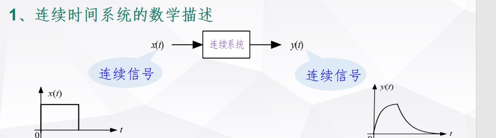
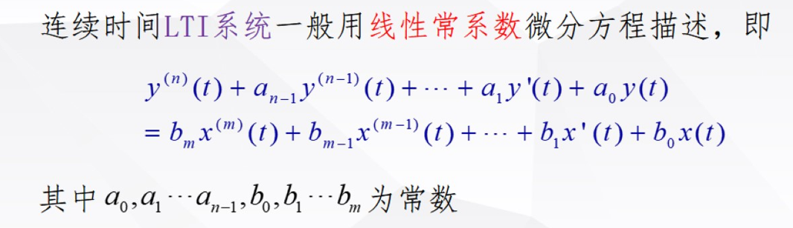
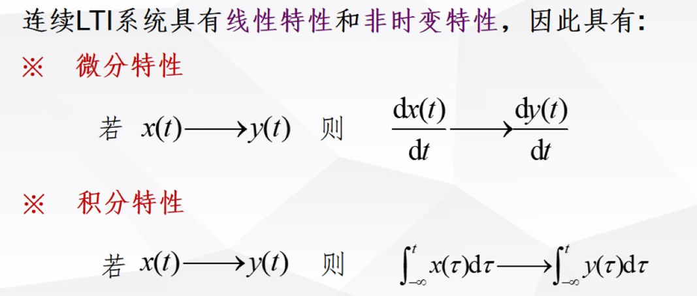
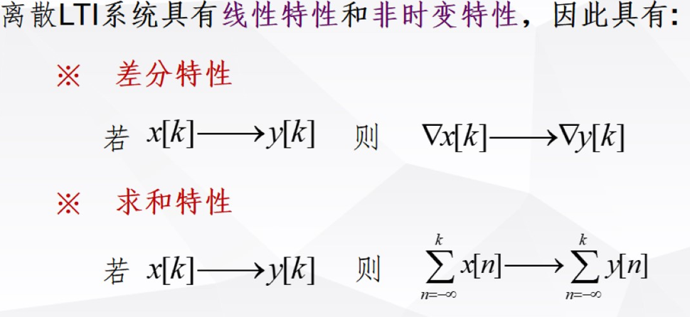
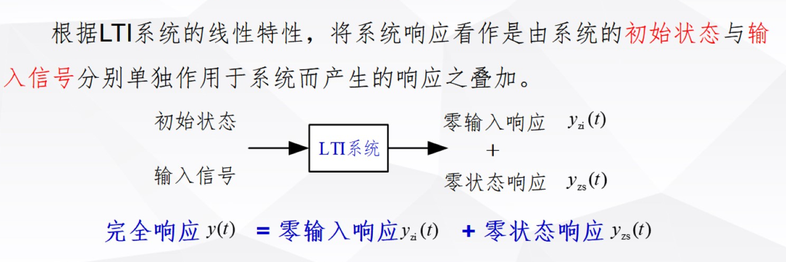
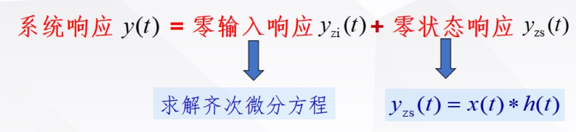
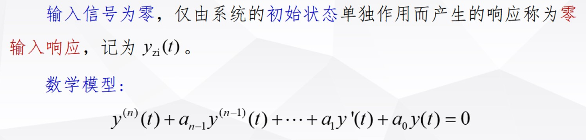
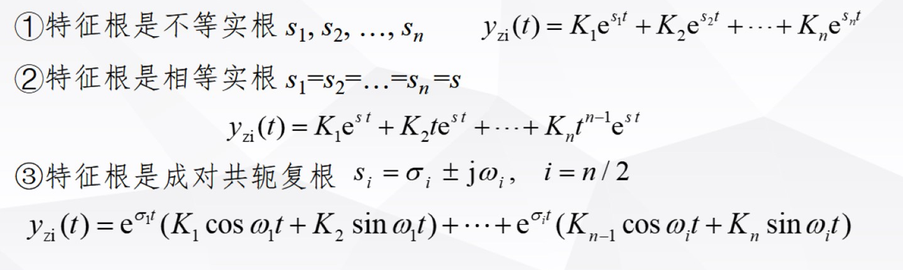
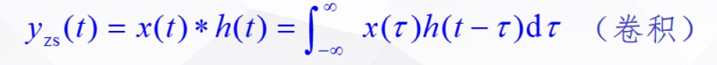
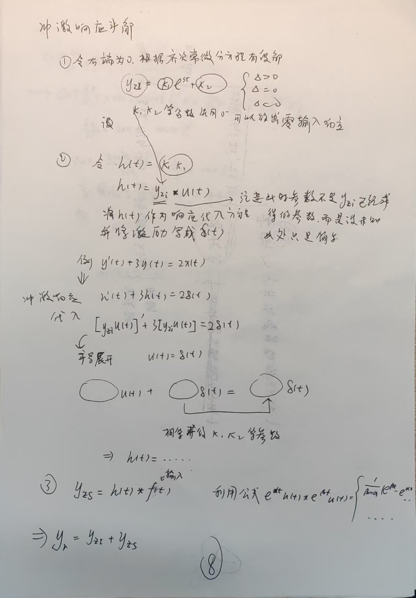

# 系统的分析

- [系统的分析](#系统的分析)
  - [1 LTI线性时不变系统的数学描述](#1-lti线性时不变系统的数学描述)
  - [2 LTI系统的响应](#2-lti系统的响应)
    - [2.1 连续时间LTI系统的响应](#21-连续时间lti系统的响应)
      - [2.1.1 解常系数微分方程](#211-解常系数微分方程)
      - [2.1.2 零输入，零状态法求解](#212-零输入零状态法求解)
        - [2.1.2.1 零输入响应（ZI）](#2121-零输入响应zi)
        - [2.1.2.2 零状态响应（ZS）、](#2122-零状态响应zs)
          - [冲激响应求解](#冲激响应求解)

**前面我们对信号进行了解构分析，这一章需要开始对系统进行分析**

- 目标
  - LTI系统的数学描述
  - 连续离散LTI系统的响应
  - 连续时间系统的卷积积分和离散时间系统的序列卷积和

## 1 LTI线性时不变系统的数学描述

**根据第一章的对系统的描述方法，有输入输出的函数（N阶微分方程）或者内部的描述（N和微分方程组），以及系统框图等描述方法**

这里数学描述主要针对N阶微分方程组进行描述

根据归纳分析，LTI系统往往可以使用线性的常系数微分方程描述、

- LTI系统的特性
  - 线性特性，满足微分积分特性!
    
    

## 2 LTI系统的响应

### 2.1 连续时间LTI系统的响应

#### 2.1.1 解常系数微分方程

**这是一种传统的基于解微分方程的数学理论方法**

- 求解常系数微分方程
  - 求齐次解
    - 特征方程求特征根
  - 求特解
    - 根据输入$x(t)$确定特解形式带入原方程

#### 2.1.2 零输入，零状态法求解

- 缺点
  - 输入信号变化，重新求解
  - 初始条件变化，重新求解
  - 右侧激励项复杂则难以求解

因此如果我们能分解出输入信号，初始条件就好了，从第一章我们发现系统可以分解成零输入和零状态从中得到灵感

----

##### 2.1.2.1 零输入响应（ZI）

**零输入响应相当于求解其次方程，又是常系数所以比较简单**

##### 2.1.2.2 零状态响应（ZS）、

**由于直接求解零状态响应较为复杂，因此我们想着把信号拆解成简单的信号，正好第一章的导论部分，冲激函数的抽样特性帮我们把信号成功的分解成了冲激函数的线性组合**

###### 冲激响应求解

----