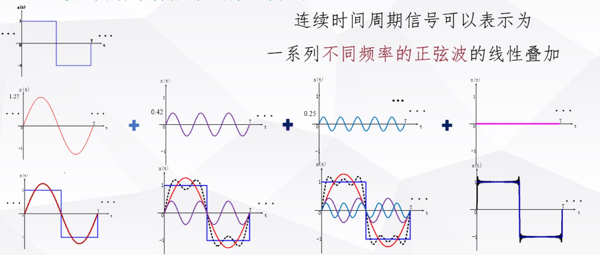
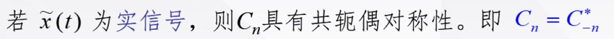

# 信号的频域分析

时域分析具有很大的局限性，我们只能对时间域的信号进行处理，而很多情况时间域不足以表征信号，

- 目标
  - 连续信号,离散信号的频域分析方法
  - 信号的抽样

## 1 连续/周期 信号的频域分析

对于周期信号而言，可以表示为一系列不同频率的正弦波的线性叠加

这也是所谓的傅里叶分析

### 1.1 三角形式傅里叶级数

$$\begin{aligned}
\tilde{x}(t)& =\frac{a_0}2+\sum_{n=1}^\infty(a_n\cos n\omega_0t+b_n\sin n\omega_0t)  \\
&=\frac{a_0}2+\sum_{n=1}^\infty A_n\cos(n\omega_0t+\varphi_n)\text{(纯余弦形式)}
\end{aligned}$$

我们将信号分解成正交的三角函数集，但是由于同时具有sin和cos不方便计算我们使用和角公式将其转化成只含有cos的项

### 1.2 指数形式的傅里叶级数

**上文当我们求谱系数的时候需要对三角函数进行积分，这是非常麻烦的，所以我们就像把激励信号换成一种更好计算的信号，因而有了指数形式的傅里叶级数**

得益于欧拉公式将指数函数域三角函数进行的链接
$$\begin{gathered}
\tilde{x}(t)=\sum_{n=-\infty}^{\infty}C_{n}\mathrm{e}^{\mathrm{j}n\omega_{0}t}\quad=C_{0}+\sum_{n=-\infty}^{-1}C_{n}\mathrm{e}^{\mathrm{j}n\omega_{0}t}+\sum_{n=1}^{\infty}C_{n}\mathrm{e}^{\mathrm{j}n\omega_{0}t} \\
=C_0+\sum_{n=1}^\infty\left(C_n\mathrm{e}^{\mathrm{j}n\omega_0t}+C_{-n}\mathrm{e}^{-\mathrm{j}n\omega_0t}\right) \\
\text{令 }C_n=\frac{a_n-\text{j}b_n}2\quad\text{则有}\quad C_{-n}=\frac{a_n+\text{j}b_n}2 
\end{gathered}$$

## 2 连续/非周期 信号的频域分析

