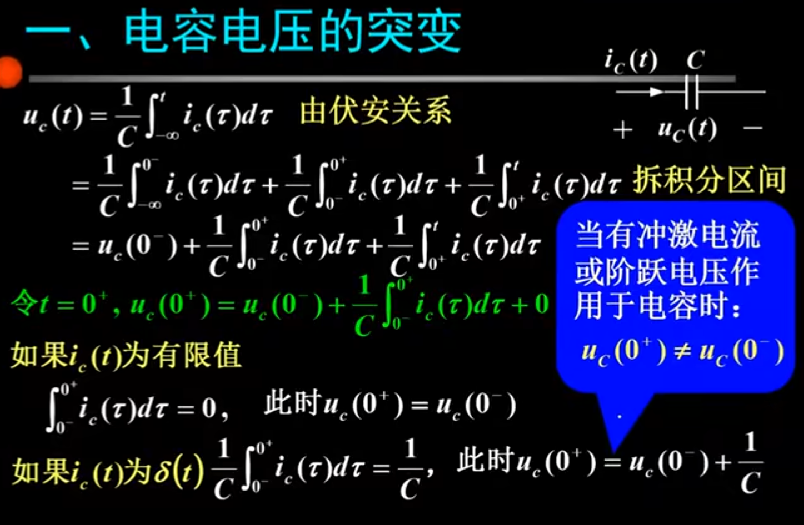

# 线性时不变系统的求解

1. 建立模型
   1. 微分方程（差分）
2. 求解方程
   1. 经典法（微分方程理论）
   2. 双零法
      1. 零输入（因为输入为零，所以相当于求解齐次常微分方程，用经典法即可）
      2. 零状态（卷积积分法）
   3. 交换域法
      1. Fourier 变换
      2. Laplace 变换

## 0 响应的划分

## 1 模型的建立

一个模型的建立本质上是找到输入和输出的关系建立方程，这种关系往往是一种微分方程，收到物理规律的约束，在信号系统中我们往往讲的是电学的约束，即网络-元件之间的约束关系

- 元件的伏安特性
- 网络的基尔霍夫方程

### 1.1 例子

## 2 系统的求解

### 2.1 经典法

### 2.2 **双零法**

#### 2.2.1 零输入响应

##### 2.2.1.1 确定初始条件

**零输入相应就是外界激励为 0 的时候，仅有自身的初始状态为条件，因此求解初始状态十分重要。**

1. 没有冲激电流/电压的时候遵从换路定则
   

2. 但是当有冲激电流强迫作用于电容或有冲激电压强迫作用于电感，0-到 0+状态就会发生跳变。
   

- 换路定则不成立的本质
  

#### 2.2.2 **零状态响应**
