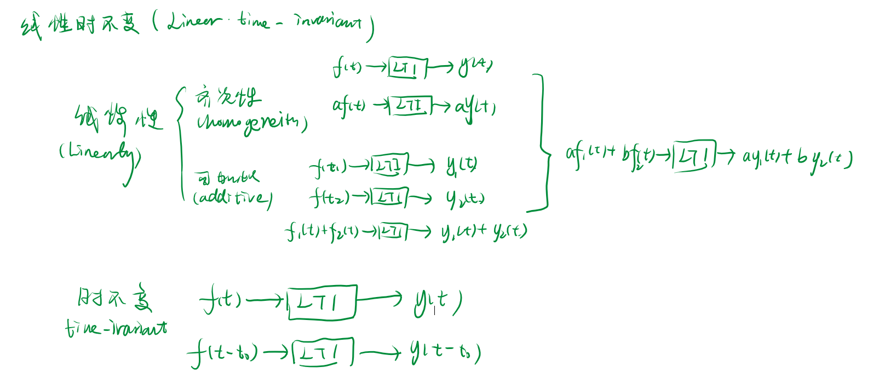
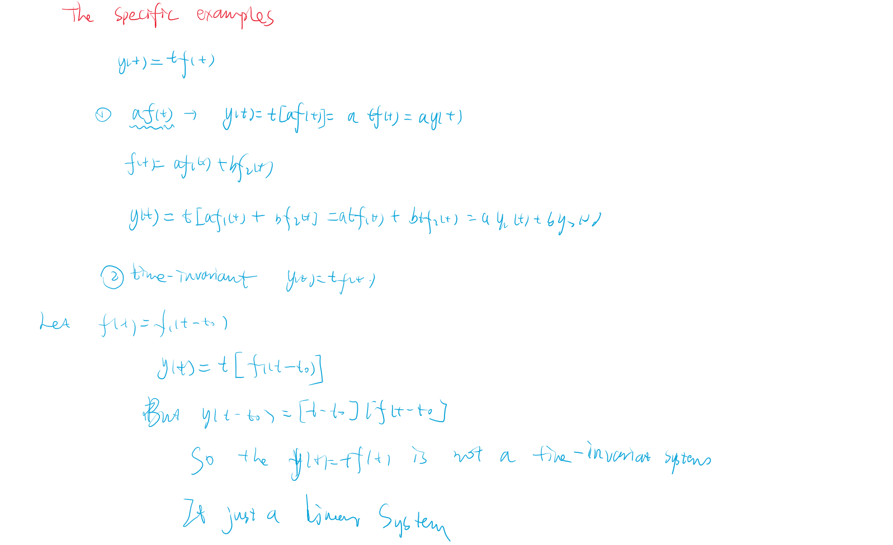
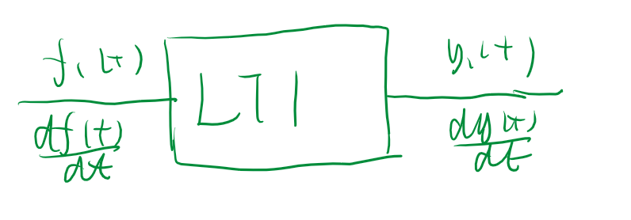
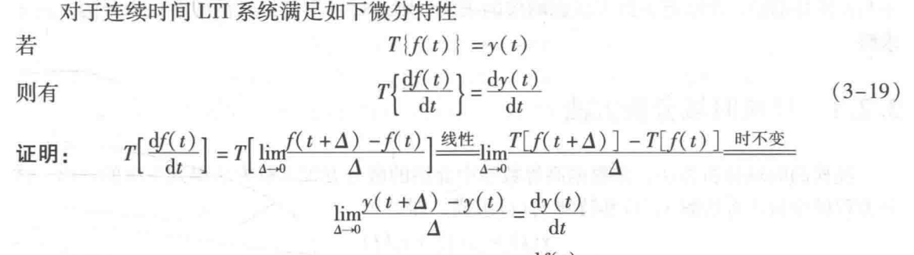
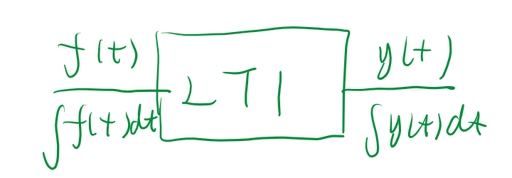
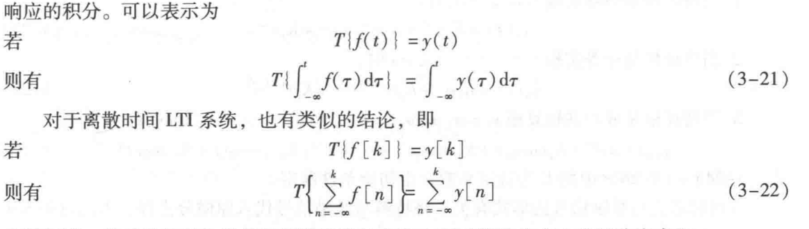

A# 线性时不变系统

## 1 The definetion of the Linear time-invariant System

### 1.1 Spercific example

## 2 Prperties of Liner Time-invariant

### 2.1 differential property

- **proof**:
  

### 2.2 Integral Characteristics

- **proof**:
  

